<!-- Header -->
<picture>
  <source media="(prefers-color-scheme: dark)" srcset="assets/header-dark.svg">
  <source media="(prefers-color-scheme: light)" srcset="assets/header-light.svg">
  
</picture>

<!-- Typing SVG -->
<p align="center">
  <a href="https://github.com/bingqin2">
    
  </a>
</p>

<!-- Links -->
<p align="center">
  <a href="https://bingqin2.github.io">
    
  </a>&nbsp;
  <a href="https://github.com/bingqin2?tab=repositories">
    
  </a>
</p>

<br>

## `> about_me.json`

I'm an MCS student at the **University of Illinois Urbana-Champaign**. I build backend systems and developer tools with **Java, Spring Boot, and Python**, and explore how AI agents can support software development.

```json
{
  "name": "Bingqin Wang",
  "education": "Master of Computer Science, UIUC",
  "focus": ["Backend development", "Developer tools", "AI agents"],
  "languages": ["Java", "Python", "TypeScript"],
  "backend": ["Spring Boot", "MySQL", "PostgreSQL"],
  "tools": ["Docker", "Git", "Linux"]
}
```

<br>

## `> tech_stack`

<p align="center">
  <a href="https://skillicons.dev">
    
  </a>
</p>

<br>

## `> featured_work`

| Project / Contribution | Highlights | Stack |
| :--- | :--- | :--- |
| **[PatchPilot](https://github.com/bingqin2/PatchPilot)** | A self-hosted GitHub issue-to-PR agent that generates patches, runs tests, and opens pull requests for review. | Java · Spring Boot · MySQL · Docker |
| **[TermScope](https://github.com/bingqin2/hy3-termscope)** | Process evaluation and causal error localization for LLM terminal agents on Terminal-Bench 2.0. | Python · Agent evaluation |
| **[Apache Airflow](https://github.com/apache/airflow)**<br>Open-source contributions | Merged Amazon provider contributions: fixed exception pickling ([#72824](https://github.com/apache/airflow/pull/72824)) and added failure-path and serialization tests for the AWS Step Functions trigger ([#72570](https://github.com/apache/airflow/pull/72570)). | Python · AWS |

**Explore:** [PatchPilot demo](https://github.com/bingqin2/patchpilot-demo-java) · [TermScope report and results](https://bingqin2.github.io/hy3-termscope/) · [All repositories](https://github.com/bingqin2?tab=repositories)

<br>

## `> contributions`

<picture>
  <source media="(prefers-color-scheme: dark)" srcset="https://raw.githubusercontent.com/bingqin2/bingqin2/output/github-snake-dark.svg">
  <source media="(prefers-color-scheme: light)" srcset="https://raw.githubusercontent.com/bingqin2/bingqin2/output/github-snake.svg">
  
</picture>

<br>

<!-- Footer -->
<picture>
  <source media="(prefers-color-scheme: dark)" srcset="assets/footer-dark.svg">
  <source media="(prefers-color-scheme: light)" srcset="assets/footer-light.svg">
  
</picture>

<p align="center"><sub>Profile layout adapted from <a href="https://github.com/alsiam/readme">alsiam/readme</a>.</sub></p>
